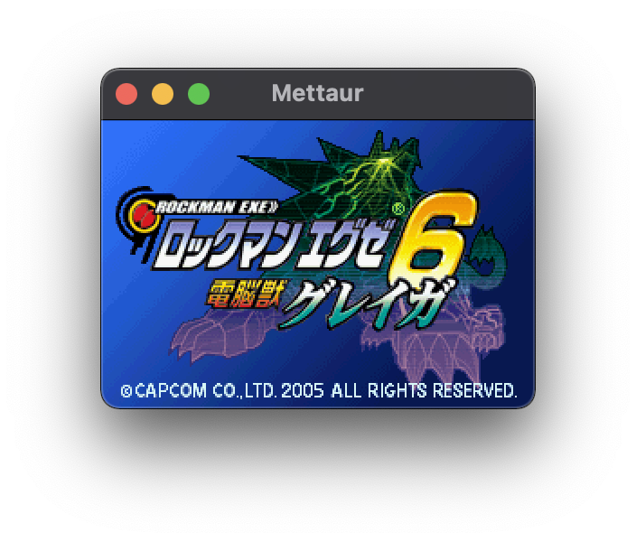
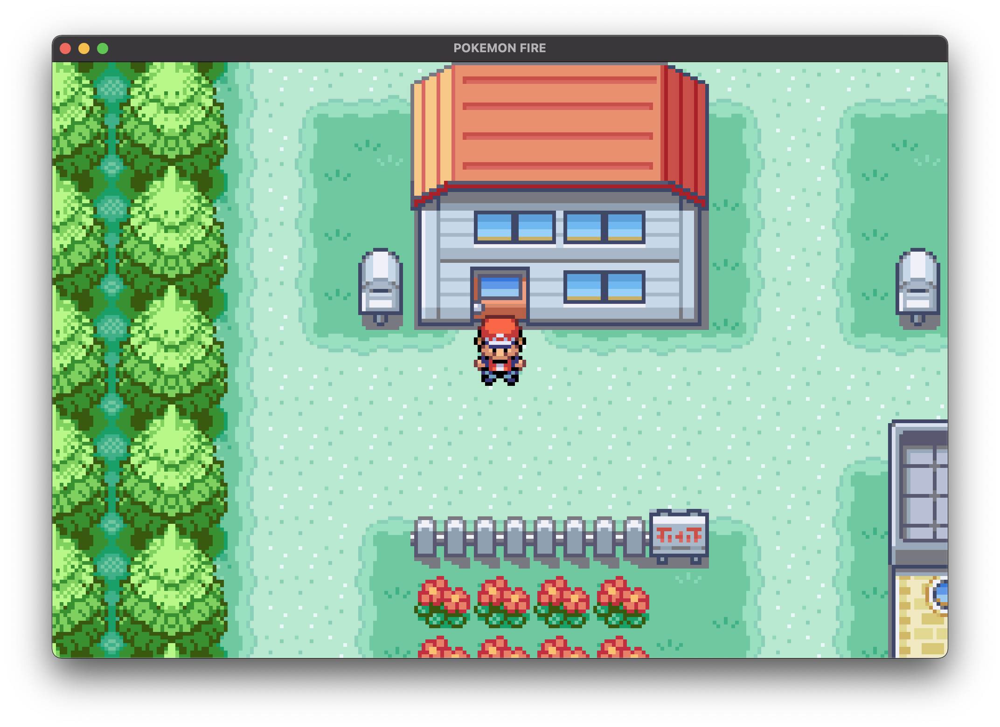
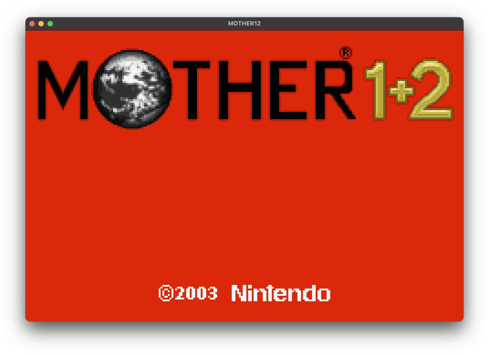
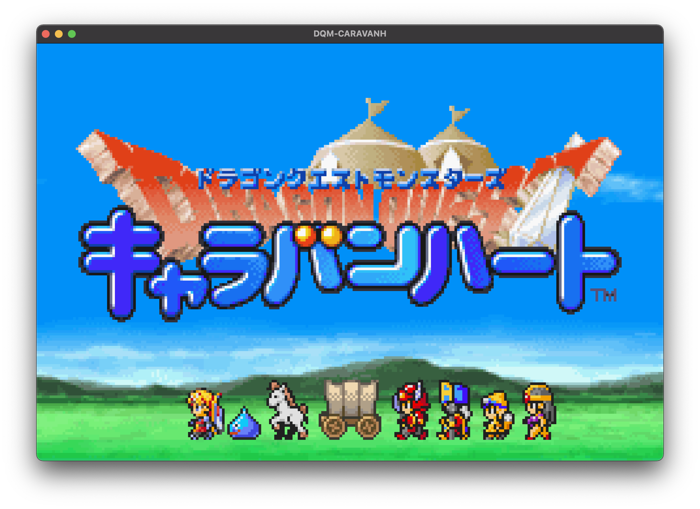

> [!CAUTION]
> This emulator project is old and NOT MAINTAINED, please see [DawnGBA](https://github.com/akatsuki105/dawngba), my new GBA emulator project!

# Magia

[](https://goreportcard.com/report/github.com/pokemium/magia)
[](https://github.com/pokemium/magia/stargazers)
[](https://github.com/pokemium/magia/blob/main/LICENSE)

Magia is GBA emulator written in golang.

**Warning: This emulator is WIP, so many ROMs don't work correctly now.**

&nbsp;

&nbsp;

## Run

Please download latest binary from [Release](https://github.com/pokemium/magia/releases).

```sh
$ magia XXXX.gba
```

## Build

```sh
# go1.16.x
$ make build
$ ./build/darwin-amd64/magia XXXX.gba
```

## Key

| keyboard             | game pad      |
| -------------------- | ------------- |
| <kbd>&larr;</kbd>    | &larr; button |
| <kbd>&uarr;</kbd>    | &uarr; button |
| <kbd>&darr;</kbd>    | &darr; button |
| <kbd>&rarr;</kbd>    | &rarr; button |
| <kbd>X</kbd>         | A button      |
| <kbd>Z</kbd>         | B button      |
| <kbd>S</kbd>         | R button      |
| <kbd>A</kbd>         | L button      |
| <kbd>Enter</kbd>     | Start button  |
| <kbd>Backspace</kbd> | Select button |

## ToDo

- [ ] Window
- [ ] GUI
- [ ] Serial communication
- [ ] GameBoy Compatibility
- [ ] Debug feature
- [ ] Fix some bugs

## Game Compatibility List

| Game Title             | Compatibility      |
| -------------------- | ------------- |
| バトルネットワーク ロックマンエグゼ2 | ✅ |
| バトルネットワーク ロックマンエグゼ3 BLACK | ✅ |
| ロックマンエグゼ4 トーナメント ブルームーン | ✅ |
| ロックマンエグゼ6 電脳獣グレイガ・電脳獣ファルザー | ✅ |
| ドラゴンクエストモンスターズ キャラバンハート | ✅ |
| MOTHER1+2 | ✅ |
| ポケットモンスター ファイアレッド | ✅ |

## Accuracy

| Test             | Result      |
| -- | -- | 
| [Memory tests](https://github.com/mgba-emu/suite/blob/04ada216ee13c56d786e54636ac980a71d791145/src/memory.c) | 1102/1552 |
| [I/O read tests](https://github.com/mgba-emu/suite/blob/04ada216ee13c56d786e54636ac980a71d791145/src/io-read.c) | 21/123 |
| [Timing tests](https://github.com/mgba-emu/suite/blob/04ada216ee13c56d786e54636ac980a71d791145/src/timing.c) | --/1660 |
| [Timer count-up tests](https://github.com/mgba-emu/suite/blob/04ada216ee13c56d786e54636ac980a71d791145/src/timers.c) | 326/936 |
| [Timer IRQ tests](https://github.com/mgba-emu/suite/blob/04ada216ee13c56d786e54636ac980a71d791145/src/timer-irq.c) | 0/90 |
| [Shifter tests](https://github.com/mgba-emu/suite/blob/04ada216ee13c56d786e54636ac980a71d791145/src/shifter.c) | 140/140 |
| [Carry tests](https://github.com/mgba-emu/suite/blob/04ada216ee13c56d786e54636ac980a71d791145/src/carry.c) | 93/93 |
| [Multiply long tests](https://github.com/mgba-emu/suite/blob/04ada216ee13c56d786e54636ac980a71d791145/src/multiply-long.c) | 52/72 |
| [BIOS math tests](https://github.com/mgba-emu/suite/blob/04ada216ee13c56d786e54636ac980a71d791145/src/bios-math.c) | 625/625 |
| [DMA tests](https://github.com/mgba-emu/suite/blob/04ada216ee13c56d786e54636ac980a71d791145/src/dma.c) | 964/1256 |
| [Misc. edge case tests](https://github.com/mgba-emu/suite/blob/04ada216ee13c56d786e54636ac980a71d791145/src/misc-edge.c) | 5/10 |

## References

- [GBATEK](https://problemkaputt.de/gbatek.htm)
- [gba_doc_ja](https://github.com/pokemium/gba_doc_ja)
- [gdkchan/gdkGBA](https://github.com/gdkchan/gdkGBA)
- [mgba-emu/mgba](https://github.com/mgba-emu/mgba)
