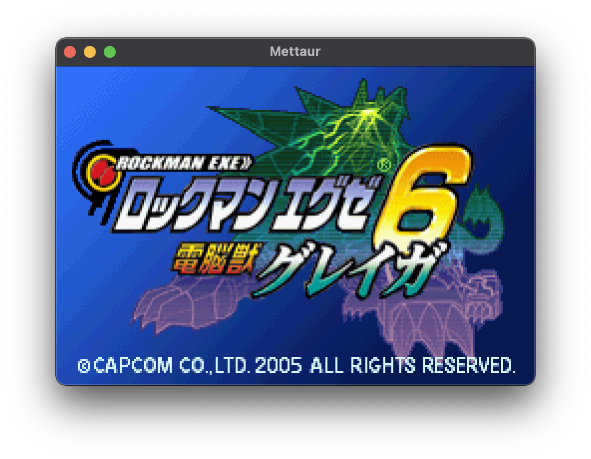
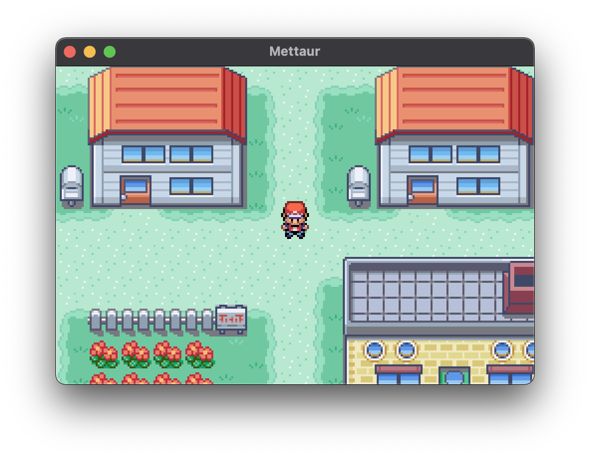
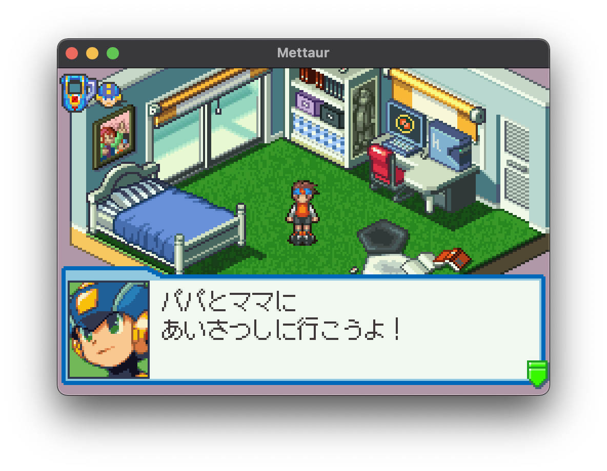

# Mettaur

[](https://goreportcard.com/report/github.com/pokemium/mettaur)
[](https://github.com/pokemium/mettaur/stargazers)
[](https://github.com/pokemium/mettaur/blob/main/LICENSE)

Mettaur is GBA emulator written in golang.

**Warning: This emulator is WIP, so many ROMs don't work correctly now.**

&nbsp;

&nbsp;

## Run

Please download latest binary from [Release](https://github.com/pokemium/mettaur/releases).

```sh
$ mettaur XXXX.gba
```

## Build

```sh
# go1.16.x
$ make build
$ ./build/darwin-amd64/mettaur XXXX.gba
```

## Key

| keyboard             | game pad      |
| -------------------- | ------------- |
| <kbd>&larr;</kbd>    | &larr; button |
| <kbd>&uarr;</kbd>    | &uarr; button |
| <kbd>&darr;</kbd>    | &darr; button |
| <kbd>&rarr;</kbd>    | &rarr; button |
| <kbd>X</kbd>         | A button      |
| <kbd>Z</kbd>         | B button      |
| <kbd>S</kbd>         | R button      |
| <kbd>A</kbd>         | L button      |
| <kbd>Enter</kbd>     | Start button  |
| <kbd>Backspace</kbd> | Select button |

## ToDo

- [ ] Window
- [ ] Mosaic
- [ ] Blend
- [ ] GUI
- [ ] Serial communication
- [ ] BG mode5
- [ ] GameBoy Compatibility
- [ ] Debug feature
- [ ] Fix some bugs

## Game Compatibility List

| Game Title             | Compatibility      |
| -------------------- | ------------- |
| バトルネットワーク ロックマンエグゼ3 BLACK | ✅ |
| ロックマンエグゼ4 トーナメント ブルームーン | ✅ |
| ロックマンエグゼ6 電脳獣グレイガ・電脳獣ファルザー | ✅ |
| ポケットモンスター ファイアレッド | ✅ |
| ドラゴンクエストモンスターズ キャラバンハート | 🔺 |
| MOTHER1+2 | 🔺 |


## References

- [GBATEK](https://problemkaputt.de/gbatek.htm)
- [gba_doc_ja](https://github.com/pokemium/gba_doc_ja)
- [gdkchan/gdkGBA](https://github.com/gdkchan/gdkGBA)
