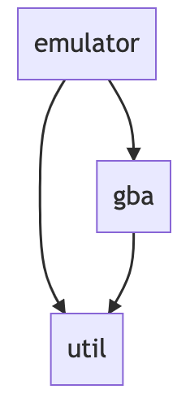

# Architecture

```sh
./pkg
├── emulator        # The application part as an emulator, such as screen drawing, sound playback, keyboard input, etc.
│   ├── audio
│   ├── debug
│   └── joypad
├── gba             # The core module of the GBA is reproduced as software.
│   ├── apu
│   ├── cart
│   ├── ram
│   ├── timer
│   └── video
└── util            # Utility functions
```

## dependencies



